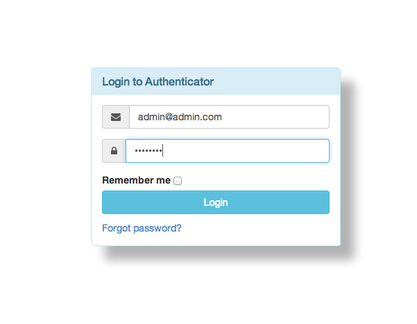
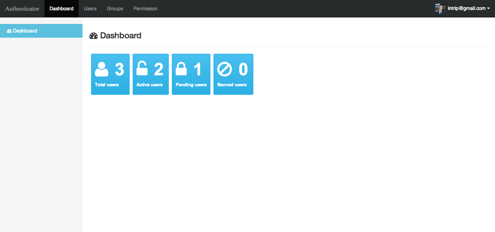
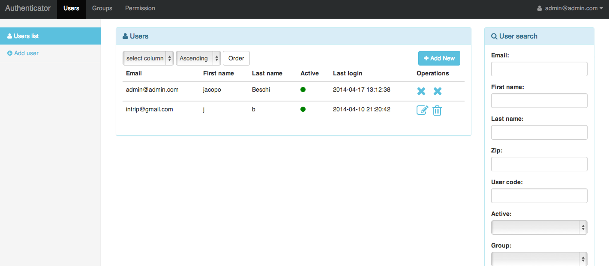
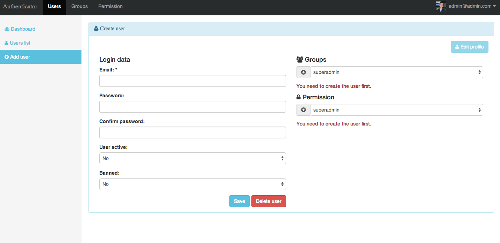
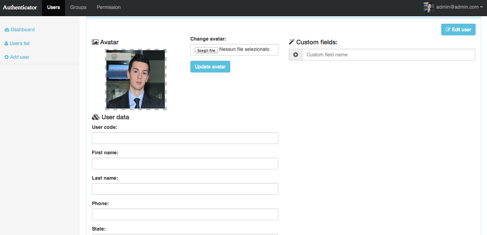
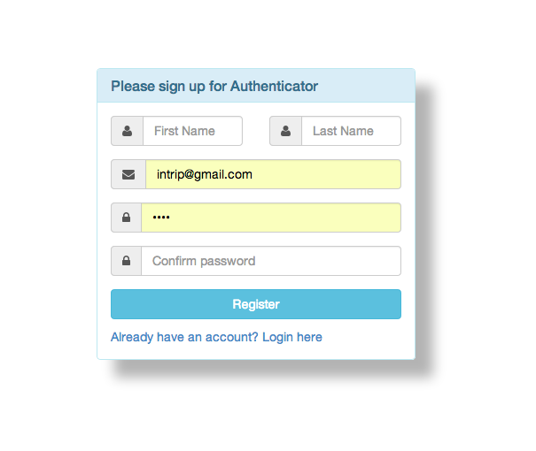

# Laravel Authentication ACL documentation #

Laravel Authentication ACL is a Laravel 4 package, based on <a href="https://github.com/cartalyst/sentry" target="_blank">sentry2</a>. <br/>
This package is made with the purpose to help developer setting up
a simple admin panel with an ACL using Laravel framework.

### Table of Contents ###
 1. [Requirements](#requirements)
 2. [Setup](#setup)
 3. [Configuration](#configuration)
 4. [How To](#howto)
 5. [Usage](#usage)
 6. [Advanced Configuration and API](#advanced)
 7. [Event hooks](#events)

## <a name="requirements">Requirements</a> ##

To install this software you need:

  * Laravel framework 4.2.*
  * Php 5.4+
  * GD Library or Imagick
  * Enable Fileinfo extension(may be needed for windows users) <a href="http://php.net/manual/en/fileinfo.installation.php">how to enable it</a>

## <a name="setup">Setup</a> ##

To install authentication follow this steps:

  1. Create an empty <a href="http://laravel.com/docs/quick" target="_blank">Laravel 4</a> installation if you don't have any.

  2. Add to your _composer.json_ require field the following lines:
      ```
      "require": {
        ...
        "jacopo/laravel-authentication-acl": "1.2.*"
      },
      ```

  3. Now run `composer update` command.

  4. Now open the file _app/config/app.php_ and add to the 'providers' option the following line:
  'Jacopo\Authentication\AuthenticationServiceProvider',

  5. Then run this command to publish the configuration files:
  `php artisan authentication:prepare`
  Now you can find configuration files in _app/config/packages/jacopo/laravel-authentication-acl_ folder.
  If you want to use a custom db(database) access configuration only for this package (while keeping other db connections for the rest of the application) edit the _app/config/packages/jacopo/laravel-authentication-acl/database.php_ file.

  6. Now you need to install the application, to do that run the command: `php artisan authentication:install`.

  Congratulations! You have succesfully installed Laravel Authentication ACL package!

  Here is the main application links:

  * http://url_of_your_application/login the client login page (after logging in will redirect you to the home page)
  [ username:<b>admin@admin.com</b> password:<b>password</b> ]
  * http://url_of_your_application/admin/login the admin login page (after logging in will redirect you to the admin panel) [ username:<b>admin@admin.com</b> password:<b>password</b> ]
  * http://url_of_your_application/user/signup the new user signup form (to register a new user)
* http://url_of_your_application/user/logout the logout page

### Note on sending emails ###
Keep in mind this software will send various notification emails, dont't forget to edit your _laravel app/config/mail.php_ file.

## <a name="configuration">Configuration</a> ##

After installing the package you can find all his configuration files under the folder: _app/config/packages/jacopo/authentication_. All the files are self documented, here is a brief overview of each configuration file:

  * _sentry/config.php_: the low level authentication configuration part, it helps you handle session cookie's name,login throttling and custom password hashing
  * _way-form/config.php_: system configuration files for form handling (do not edit)
  * _config.php_: basic configuration
  * _menu.php_: to create __dynamic admin menu__ with arbitrary permissions
  * _database.php_: custom database configuration file
  * _permission.php_: general permissions configuration
  
## <a name="howto">How To</a> ##

  1. How to add a new menu item?

    First go to menu.php and add the new menu item entry along with the permissions.
    And secondly go to your routes.php and add for the specified route the following
    'before' => array('logged', 'can_see'), that way a user must be login first and
    have the appropriate permissions in order to access the specified route.

  2. How to add permissions to a route that is not in the menu?
    <br/>
    __Option1__(deprecated): Go to the menu.php and add it as a new menu item but leave the name empty.
    ```
    [
        "name" => "",
        "route" => "myrouteprefix",
        "link" => URL::route('myrouteprefix.index'),
        "permissions" => ["_superadmin"]
    ]
    ```
    <br/>
    __Option2__ : use the 'has_permission' filter. In order to do that add the 'has_permission' filter to
    your before option in the routes file as following:

        Route::get('/example', [
                'before' => 'has_perm:_permissionA,_permissionB'
                'uses' => 'Jacopo\Authentication\Controllers\UserController@getList'
        ]);
    In this case if the user has '_permissionA' or '_permissionB' permission he can see the page, otherwise gets a 401 error.
    <br/>

  3. How to add items in sidebar?

    To make use of the sidebar shown in admin area, your view must extend the following template:

    @extends('laravel-authentication-acl::admin.layouts.base-2cols')

    Next inside your controller action add the items to the sidebar as follows:
    ```
    $sidebar = array(
                "Users List" => array('url' => URL::route('myrouteprefix.list'), 'icon' => '<i class="fa fa-users"></i>'),
                'Add New' => array('url' => URL::route('myrouteprefix.new'), 'icon' => '<i class="fa fa-plus-circle"></i>'),
            );
    ```
    Next you need to attach the sidebar menu items to your view as follows:
    ```
    return View::make('myrouteprefix.index')->with('sidebar_items' => $sidebar);
    ```
   <br/>

  4. How to hide access on a given url to anonymous user?

   In order to do that you need to apply the 'logged' filter to your route, if the user is not logged it will be
   redirected to /login. If you want to redirect to a given url you could do that by passing a custom parameter to
   the filter as following:

   ```
   Route::get('check_custom', [
   'before' => "logged:/custom_url",
    'uses' => function(){
         // put your code here
    }]);
   ```
   In this case anonymous users will be redirected to _custum_url_ page.
    <br/>

  5. How to use gravatar for profile?

      If you want to use gravatar `for profile image instead of the custom image you need to enable the option 'use_gravatar' in the
      main configuration file.<br/>
      If you need to get the path of the current user avatar you can use the following code: `$logged_user->user_profile()->first()->presenter()->avatar($size)`

  6. How to use my custom views?

     If you want to use your custom views first run the following command: ```php artisan view:publish jacopo/laravel-authentication-acl```. That command creates
     a copy of the default views in _app/views/packages/jacopo/laravel-authentication-acl_ folder. If you edit them they will be used instead of the default views
     for the package. Any composer update command will not override your costumization so it's __update free__. Enjoy!.


## <a name="usage">Usage</a> ##
You have four main link to access the application.

The first is the user login page available at: http://url_of_your_application/login.
With the user login page (after login) you will be redirected to the root application folder: "/"
The second main link is the admin login page, available at http://url_of_your_application/admin/login.
Here is the sceenshoot of the admin login page:



After the login you will be redirected to the dashboard page:

<a href="images/dashboard.png" target="_blank" ></a>

The main panel contains four main menu links(on top): dashboard, users, groups and permissions. Following this link you will be redirected to the corresponding area.
On every page you may see a panel to filter the results in the list (on the right) and a sidebar on the left with the link to add a new resource or to list all the resources.

You can see all the users and filter them with the users link(on top):

<a href="images/admin_main.png" target="_blank" ></a>

If you want to create a new user you need to click on the _add user/add new_ button:

<a href="images/add_user.png" target="_blank" ></a>

After filling the form you can also create/edit a user profile with the _edit profile_ link:

<a href="images/edit_profile.png" target="_blank" ></a>

In the profile form you can setup an avatar for the user and also add custom profile fields.
When you add a new custom field it will be added in all the user's profile form.
<br/> __Attention:__ to add custom profile field an user need the permission set in the _permission.php_ configuration file.

The listing/filtering and editing of groups and permission respect the same structure as for the users (just use the links on the main menu).

The third link is the user signup form available at: http://url_of_your_application/user/signup:

<a href="images/signup.png" target="_blank" ></a>

The last link is the logout link available at: http://url_of_your_application/user/logout

### Permissions handling ###

  Every user belongs to a certain number of groups(you can edit them in the user page). You can also define custom permission for user and groups. When the software search for permissions it will join the permission that are associated to the user, with the one of all the groups that belongs to the user; if the permissions to check for is in that list the check will pass otherwise it won't pass.

## <a name="advanced">Advanced configuration and API</a> ##

By installing the package you have two helper classes available anywhere in your application:

* authentication : you can obtain this class with the following code: ``<?php $authentication = \App::make('authenticator'); ?>``
                    The class have the following methods:

                    `
                    /**
                    * Force authentication on a user
                    *
                    * @param array $credentials: an array with the following structure: ["email" => "user_email", "password" => "user_password"]
                    * @param boolean $remember
                    * @return mixed
                    */
                    public function authenticate($credentials, $remember);

                    /**
                    * @param $user
                    * @param $remember
                    * @return mixed
                    */
                    public function loginById($id, $remember);

                    /**
                    * Logout
                    *
                    * @return mixed
                    */
                    public function logout();

                    /**
                    * @return mixed
                    */
                    public function getErrors();

                    /**
                    * Obtain the user with his email
                    *
                    * @param $email
                    * @return mixed
                    * @throws \Jacopo\Authentication\Exceptions\UserNotFoundException
                    * @return mixed
                    */
                    public function getUser($email);

                    /**
                    * Obtains a user given his user id
                    *
                    * @param $id
                    * @return mixed
                    */
                    public function getUserById($id);

                    /**
                    * Obtain the current logged user
                    *
                    * @return mixed
                    */
                    public function getLoggedUser();
                    `

You can find the user class in the file: _vendor/jacopo/authentication/src/Jacopo/Authentication/Models/User.php_
* authentication_helper : you can obtain this class with the following code: `<?php $authentication = \App::make('authentication_helper'); ?>`

                    The class have the following methods:
                    /**
                    * Check if the current user is logged in and has any of the
                    * permissions given in $permissions
                    * @param array $permissions contain strings with the permissions name
                    * @return boolean
                    */
                    public function hasPermission(array $permissions);`

Also for route handling and permission you should check the class: `Jacopo\Authentication\Helpers\FileRouteHelper`.

### Blocking editing of a user/group or permission for the admin ui ###
In case you want to block the editing of a _user/group/permission_ from the admin ui you need to open any dbms editor (like phpmyadmin) and go to the relative row in the corrisponding table associated _(users,groups,permission)_ and then set the flag of the column "protected" to "1".

### How to run all tests ###
To run all the tests you need <a href="http://phpunit.de/getting-started.html" target="_blank">phpunit</a> and <a href="https://sqlite.org/" target="_blank">sqlite3</a> installed on your system.
Then go in _vendor/jacopo/authentication_ folder and run the command: `phpunit`.
<br/>
Note: If you want to use a different dbms for testing change the `CURRENT_DBMS` constant to the corrisponding dbms and update `connections_configuration` in the _Jacopo\Authentication\Tests\DbTestCase.php_ file, then run `phpunit`.
<br/>
If you're using postgres for testing you need to increase your `max_connections` option to make the tests pass.

## <a name="events">Event hooks</a> ##

The package fires multiple laravel events and you can hook on them within your application, here is the list of them(with the variables being sent):

 - "customprofile.creating{}": before creating a new custom profile type field
 - "customprofile.deleting{}": before deleting a new custom profile type field
 - "repository.updating{$object}": before running an update query on a repository
 - "repository.updated{$object}": after running an update query on a repository
 - "repository.deleting{$object}": after running an update query on a repository
 - "service.activated{$user}": after an user is activated
 - "service.registering{$input}": before registering a new user
 - "service.registered{$input, $user}": after registering a new user
 - "service.authenticating{$input, $remember}": before logging in
 - "service.authenticated{$input, $remember, $user}": after logging in
 - "service.delogging{}": before logging out
 - "service.delogged{}": after logging out
